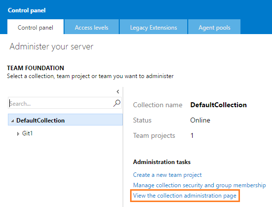
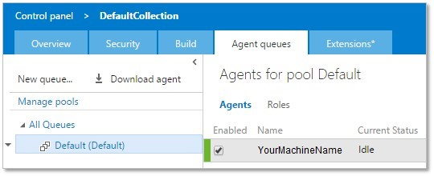

# On-premises Server

These instructions cover installing and configuring an agent to connect to your on-premises Team Foundation Server 2015 or later.  We recommend having the latest quarterly update installed.

## Configure Your Server for Basic Authentication + SSL

Basic authentication is required for OSX and Linux access.  
Ensure SSL/HTTP is enabled to secure the communication channel, since basic credentials are transmitted in plain text.

See [Configuring TFS to use Basic Authentication](https://github.com/Microsoft/tfs-cli/blob/master/docs/configureBasicAuth.md).

## Account and Roles

Determine the local or domain user the agent will run as.  In the TFS Administration portal, add that user to *both* pool roles:

  1. Agent Pool Administrators (allows the agent to register)
  2. Agent Pool Service Accounts (allows the agent to listen to the build queue)


Also add the user to the collection-level group "Project Collection Build Service Accounts" for any collections the agent will service.  There is usually one collection named _DefaultCollection_.




## Install

By Installing the agent, you are accepting the terms on the [Team Explorer Everywhere EULA](teeeula.md).

Running this from the command line (terminal) will download prerequisites, install/update the agent bits globally and create an agent in your current directory.  Make a new directory for your agent

> Tips:  
> To minimize permission issues, login to the agent machine as the above user.  
> The agent directory should be created under the user's home directory (~).  

Copy and paste the curl line.  If your linux box does not have curl [follow this answer](http://askubuntu.com/questions/259681/the-program-curl-is-currently-not-installed)

From a terminal:
```bash
mkdir tfsagent
cd tfsagent
curl -skSL http://aka.ms/xplatagent | bash
```
Your output should look [similar to this](sampleoutput.md).
If you have issues with this, fully realized zips are available in this repo's [Releases](https://github.com/Microsoft/vso-agent/releases) section.

### Configure on First Run

> Tips:  
> For TFS, answer **true** (not the default) to the 'Enter force basic' prompt.  
> Be sure to use a server-level URL with no collection name specified (https://server:8080/tfs, not https://server:8080/tfs/DefaultCollection).  

Run the agent.  You will be prompted for configuration (saved as an .agent file) the first time it is run:
```bash
~/tfsagent$ ./run.sh
Enter alternate username > [yourDomain\]yourUsername
Enter alternate password > yourPassword
Enter agent name (enter sets yourMachinename)  > 
Enter agent pool name (enter sets default)  > 
Enter poolName(enter sets default) > 
Enter serverUrl > http://yourTFSServer:8080/tfs
Enter force basic (enter is false)  > true
Successful connect as undefined
. . .
2016-03-24T19:08:43.188Z: Agent Started.
```

The agent is now running interactively.  Typing ctrl-c will exit the agent.  You may also verify that the agent has connected to TFS in the list of agents connected to the collection's build pool:



## Update an Existing Agent

Before updating an existing agent, stop it (ctrl-c if interactive; if running as a service, see [run as a service](service.md)).
Next, to update the agent, run the same command used to install it from the agent root directory (package.json will be in that folder).
```bash
cd tfsagent
curl -skSL http://aka.ms/xplatagent | bash
```

Your output should look [similar to this](sampleoutput.md)

## Run as a Service

Running interactively is good for testing and evaluation, but in production, the agent should be run as a service to ensure the agent survives reboots.

[How to Run the Agent as a Service](service.md)


## Agents without Internet Access

If you have server and agent machine without internet access, use a computer that does have internet access to
download the appropriate agent package from the [Releases](https://github.com/Microsoft/vso-agent/releases) page to a thumbdrive.
Use that copy to install agents on machines in your private network.
