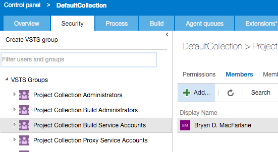

# On Premises Server

These instructions cover installing and configuring an agent to connect to your on premises Team Foundation Server 2015 or later.  We recommend having the latest quarterly update installed.

## Configure Server for Basic + SSL

Basic Auth is required for OSX/Linux Access.  
Ensure ssl/https to secure the communicattion channel since basic credentials in the clear over the network.

[Instructions Here](https://github.com/Microsoft/tfs-cli/blob/master/docs/configureBasicAuth.md)

## Account and Roles

Determine the local or domain user to use.  Add to *both* pool roles:

  1. Agent Pool Administrators (allows to register)
  2. Agent Pool Service Accounts (allows listening to build queue)


Then add the account to the collection level "Project Collection Build Service Accounts" group for any collections it will build.



## Install

By Installing the agent, you are accepting the terms on the [Team Explorer Everywhere EULA](teeeula.md)  

Running this from the command line (terminal) will download prereqs, install/update the agent bits globally and create an agent in your current directory.  Make a new directory for your agent

> Tips 
> Directory should be created under the users home directory (~).  
> Prefer running the agent as the logged in user and creating under ~ will minimize permission issues.

Copy and paste the curl line.  If your linux box does not have curl [follow this answer](http://askubuntu.com/questions/259681/the-program-curl-is-currently-not-installed)

From a terminal:
```bash
mkdir myagent
cd my agent

curl -skSL http://aka.ms/xplatagent | bash
```
Your output should look [similar to this](sampleoutput.md)

To install preview version (usually master), use:

```bash
curl -skSL http://aka.ms/previewxplat | bash
```

### Configure on first run

>> TIPS:
>> IMPORTANT: for TFS, ensure you answer true (not the default) for force basic
>> Ensure it's server level url (no collection)
>> If the agent isn't configured (.agent file exists), on first run, it will configure.

```bash
$ ./run.sh
Enter alternate username > yourusername
Enter alternate password > yourpassword
Enter agent name (enter sets yourmac.local)  > 
Enter agent pool name (enter sets default)  > 
Enter poolName(enter sets default) > 
Enter serverUrl > http://mytfsserver:8080/tfs
...
Enter force basic (enter is false)  > true
Config saved
Waiting ...
```

An agent is now running interactively.  ctrl-c will exit the agent.

## Update Existing Agent

Run the same command used to install from the agent root directory (package.json will be in that folder)

Before updating stop the agent (ctrl-c if interactive, if service [see run as a service](service.md))

From a terminal:
```bash
curl -skSL http://aka.ms/xplatagent | bash
```
Your output should look [similar to this](sampleoutput.md)

## Run as a Service

Running interactively is good for testing and evaluation.  But, in production the agent should be run as a service
to ensure the agent survives reboots.

[How to run as a service](service.md)


## Agents without Internet Access

If you have Server and Agent without internet access, it's possible to download and agent to a thumbdrive from a computer that has internet access (you need it to download :)) and then then use that to stamp out agents on your private network agent machines.

Run the Install steps above and simply copy that created folder to a thumbdrive.  From the private agent, copy that folder and then follow the steps after Install to configure the agent.

After copying the folder from the thumbdrive, ensure the logged on account has rwx permissions
